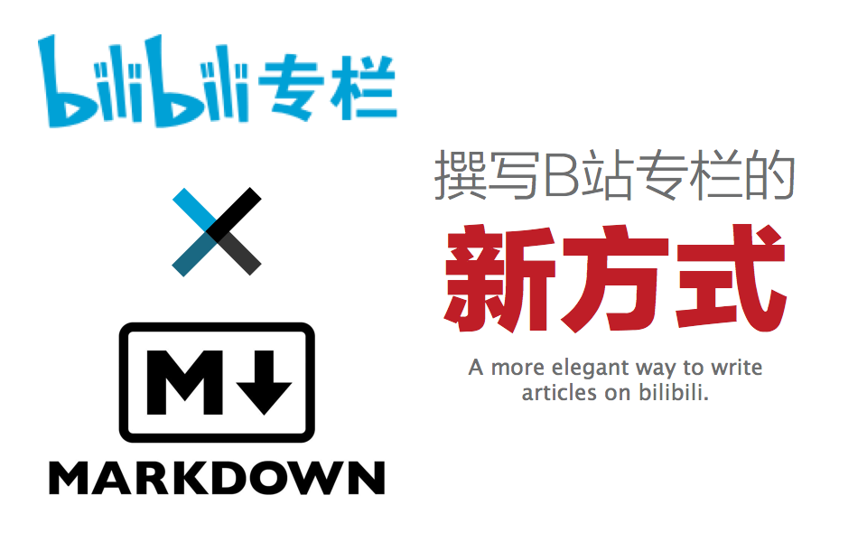
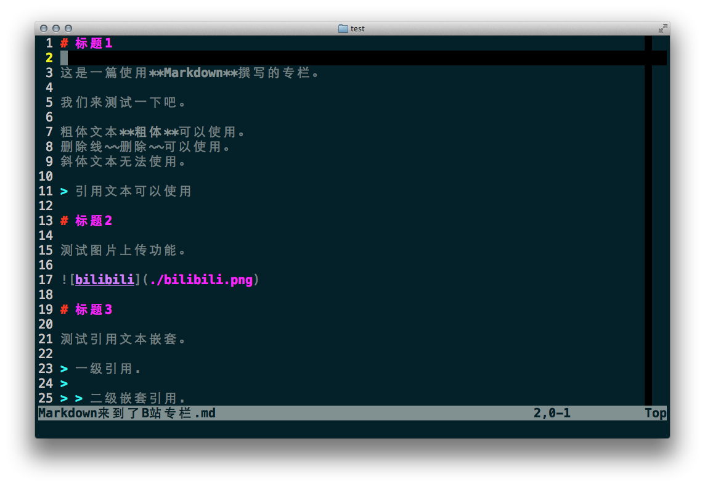
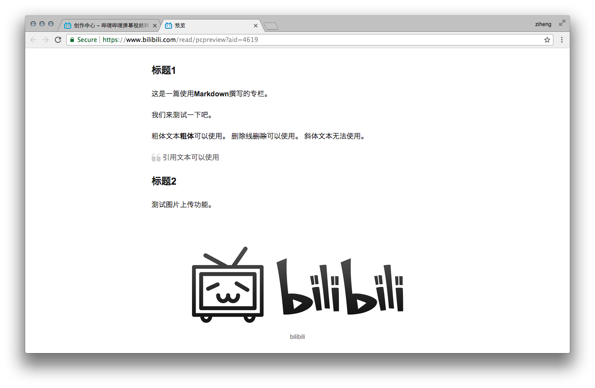

# Bilibili Zhuanlan Markdown Tool



A useful tool for writing Markdown format on bilibili zhuanlan.

一款可以让你使用`Markdown`格式撰写哔哩哔哩（bilibili.com）专栏文章的辅助工具。

# Usage（使用说明）

## Step by step

1. Install `Node.js` environment first.

2. Install project dependencies using `npm install`.

3. Go to *bilibili.com*, set a zhuanlan article draft.

4. Get and save article's `aid` and page's `cookies` into a `.json` config file by yourself.

5. Writting with `Markdown` freely!

6. Run `node src/cli.js [md_path] [config_path]` for your own purpose.

## 使用步骤

1. 请先在本机装好`Node.js`环境。

2. 使用`npm install`安装项目依赖。

3. 前往哔哩哔哩（bilibili.com）专栏投稿区，建立一篇专栏草稿。

4. 取得文章`aid`与页面`cookies`，写入配置文件。

5. 使用`Markdown`写作吧！

6. 运行`node src/cli.js [md_path][config_path]`来提交你的`Markdown`文章。

# Configure（配置选项）

The `.json` config file of the tool is really simple, just looks like that:

程序配置文件非常简单，就像这样子：

```
{
  "aid":     "",
  "cookies": ""
}
```

For more details:

更详细的说明：

```
- aid     ->  文章标识号
- cookies -> `javascript:alert(document.cookie);`
              以下四枚 Cookie 必需, 有效期大概1个月（过期重取）
             "DedeUserID"
             "DedeUserID__ckMd5"
             "SESSDATA"
             "bili_jct"
```

# Example（实例说明）

通过一个实例，教大家具体如何使用此工具。

**步骤1, 2**略过，不演示，安装`Node.js`环境与项目依赖，大家都会的。

我们从**步骤3**开始，前往哔哩哔哩（bilibili.com）专栏投稿区，建立一篇专栏文章草稿。文章标题并不重要，可以随意写，我们只需要这篇专栏草稿成功保存（即在B站服务器留下记录）即可。如果不确定是否成功保存，可以点击专栏区下方的*存草稿*按钮。


> 图: 步骤3-1演示


> 图: 步骤3-2演示

接下来，我们需要**手动**取得两枚关键参数来写配置文件，`aid`与`cookies`。其中，`aid`是这篇专栏文章的标识号，`cookies`用来做认证。只有取得这两枚关键参数，我们才可以与B站专栏服务器进行交互。
获取这两枚参数的方式都非常简单，`aid`在地址栏上就有写，`cookies`则可以通过在目标页面地址栏键入`javascript:alert(document.cookie);`命令取得。泄露`cookies`会有安全风险。


> 图: 步骤4-1演示 获取`aid`


> 图: 步骤4-2演示 获取`cookies`

接下来，将这两枚关键参数写成`.json`配置文件，配置文件名可以随意取。为了方便起见，我这里存储为`config.json`好了。

```
{
  "aid":     "4619",
  "cookies": "im_local_unread_1584633=0; _cnt_dyn=undefined; _cnt_pm=0; _cnt_notify=0; uTZ=-480; user_face=https%3A%2F%2Fi1.hdslb.com%2Fbfs%2Fface%2F6924d7e00ab833cc20bc97c7d4147308b84464ae.jpg; finger=0e029071; buvid3=9800BBA9-3DE9-4C50-99B1-29ABE518D62E59218infoc; im_seqno_1584633=22; CURRENT_QUALITY=15"
}
```

至此，准备工作已完成，我们就可以告别B站专栏富文本编辑器，转而使用`Markdown`格式撰写文章啦！**拿起你最钟爱的`Markdown`编辑器，愉快地写作吧！**



> 图: 一篇`Markdown`格式的文章（Markdown来到了B站专栏）

最后，我们来将这篇`Markdown`格式的文章**变身**成为B站专栏文章。键入命令来提交你的`Markdown`文章。将你的文章与配置文件一并输入该工具，注意顺序哦。

```
$ node src/cli.js './test/Markdown来到了B站专栏.md' './test/config.json'
```
让我们回到专栏草稿箱看一看，我们会发现，这篇`Markdown`格式的文章已经变成了B站专栏文章了，专栏文章的大标题正是`Markdown`文件名。我们可以预览查看。



> 图: `Markdown`已变身成为专栏文章（网页端预览）

添加头图，选择分类，写专栏推荐语，这些都是文章发布前的准备工作。完成后就可以提请发布文章啦。当然，发布前B站肯定要审核文章的啦。

# Develop（开发相关）

A short example to show how to develop with the tool.

一个利用该工具的代码小例子：

```
/*
 * API 说明
 * 参数: (Markdown 文档路径, 配置选项)
 * 处理流程: 取得 MD 文档与配置选项 -> Markdown 转换 HTML ->
 *           上传本地图片取得B站外链 -> 替换本地图片地址为B站外链地址 ->
 *           合成表单发送更新
 */
biliZhuanlanMarkdown.startProcess (
    './test.md',
    {
      "aid":     "",
      "cookies": ""
    }
);
```

# Attentions（注意事项）


# License（许可）

MIT

